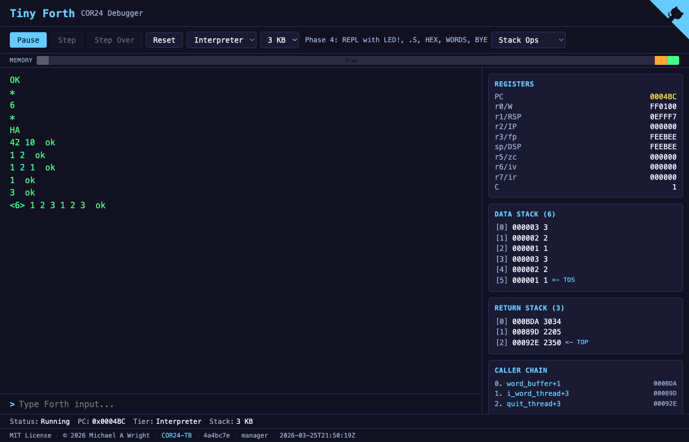

# Tiny Forth — COR24 Debugger

Browser-based Forth debugger running the [tf24a](https://github.com/sw-vibe-coding/tf24a) DTC Forth interpreter on the COR24 emulator via WASM.



## Features

- **Interactive REPL** — type Forth commands, see results immediately
- **Demo dropdown** — pre-built `.fth` demos (LED Blink, Arithmetic, Stack Ops, Hex Mode, Comparison, Return Stack, Words)
- **Hardware I/O** — visual LED D2 and clickable Switch S2
- **Debugger** — step, step-over, breakpoints, run/pause
- **Inspection panels** — registers, data stack, return stack, caller chain, disassembly, dictionary browser, compile log
- **Memory map** — visual bar showing kernel, free, return stack, and data stack regions
- **Multi-tier** — Bootstrap (Phase 1) and Interpreter (Phase 4) assembly tiers

## Build and Serve

```bash
trunk build                    # Build WASM to dist/
trunk serve --port 9181        # Dev server with hot reload
cargo clippy -- -D warnings    # Lint
cargo fmt --all                # Format
```

## License

MIT
